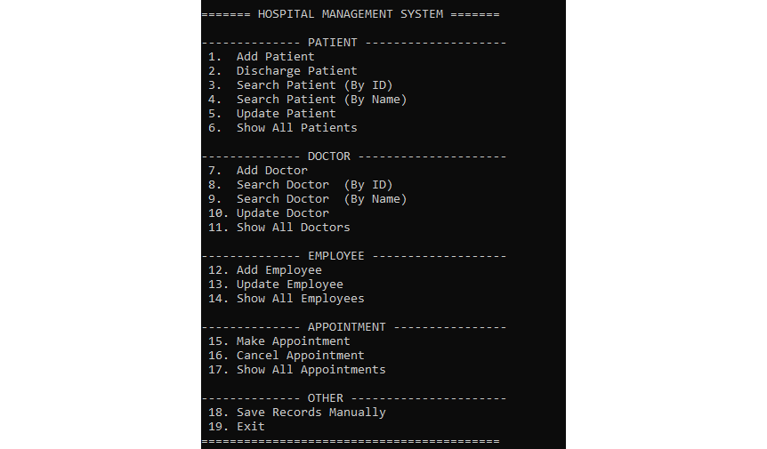
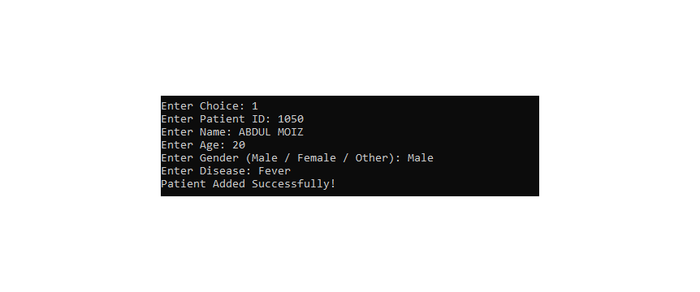
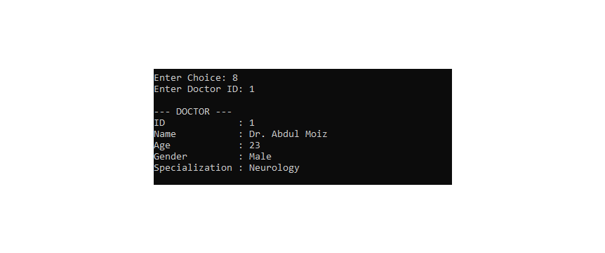
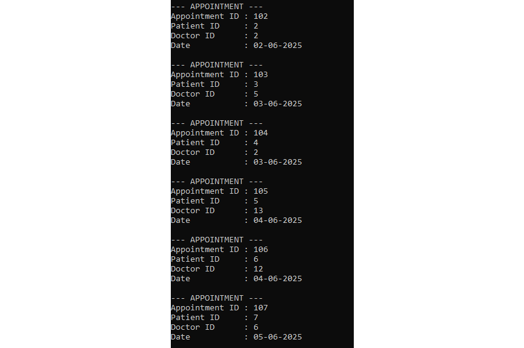
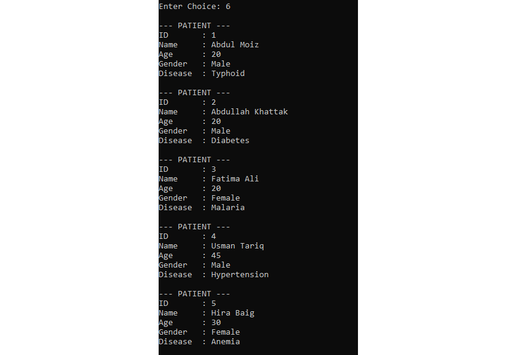

# Hospital Management System (C++)

## Overview

Hospital Management System is a console-based application developed in C++. It helps manage patients, doctors, employees, and appointments through a menu-driven interface. The project also supports automatic file saving and loading to preserve records between program executions.


## Features

- Patient Management
  - Add Patient
  - Search Patient
  - Update Patient
  - Discharge Patient
  - Display All Patients

- Doctor Management
  - Add Doctor
  - Search Doctor
  - Update Doctor
  - Display All Doctors

- Employee Management
  - Add Employee
  - Update Employee
  - Display All Employees

- Appointment Management
  - Create Appointment
  - Cancel Appointment
  - Display Appointments

- Automatic File Saving
- Automatic File Loading
- Input Validation
- Menu Driven Interface

## Technologies Used

- C++
- Standard Template Library (STL)

Libraries Used

- iostream
- vector
- string
- limits
- fstream
- sstream

## OOP Concepts Used

- Classes and Objects
- Inheritance
- Polymorphism
- Abstraction
- Encapsulation
- Constructors
- Destructors
- Virtual Functions


## File Handling

The application automatically stores records in the following files:

- patients.txt
- doctors.txt
- employees.txt
- appointments.txt

These files are created automatically when the program runs.


## How to Run

Clone the repository

```bash
git clone https://github.com/Dev-Moiz886/hospital-management-system-cpp.git
```

Compile

```bash
g++ main.cpp -o hospital
```

Run

```bash
./hospital
```


## Future Improvements

- Login System
- Password Authentication
- Billing Module
- Pharmacy Management
- GUI Version
- Database Integration (MySQL)
- Report Generation


## Screenshots

### Main Menu



### Add Patient



### Doctor Management



### Appointment Management



### Patient Records




## Author

Abdul Moiz

BS Computer Science,
<brs>
UET Taxila